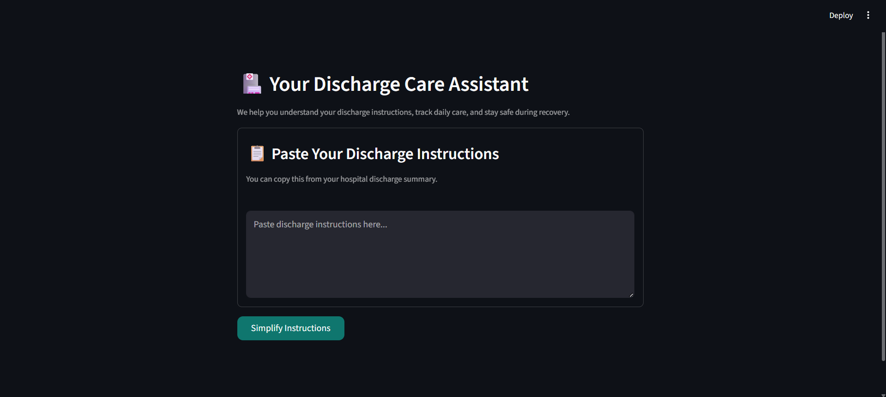
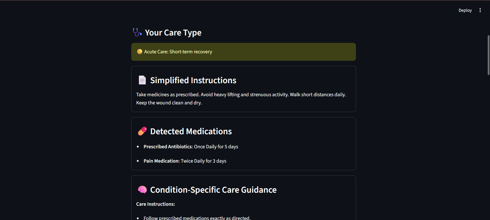
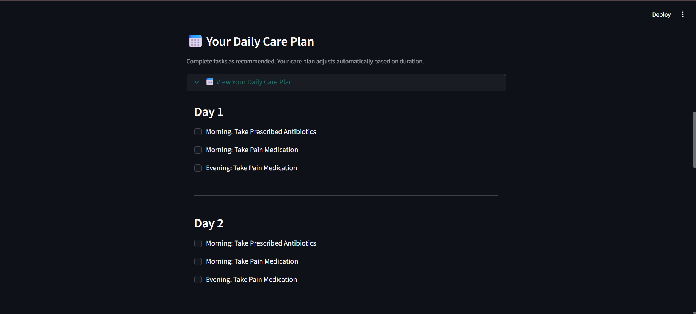
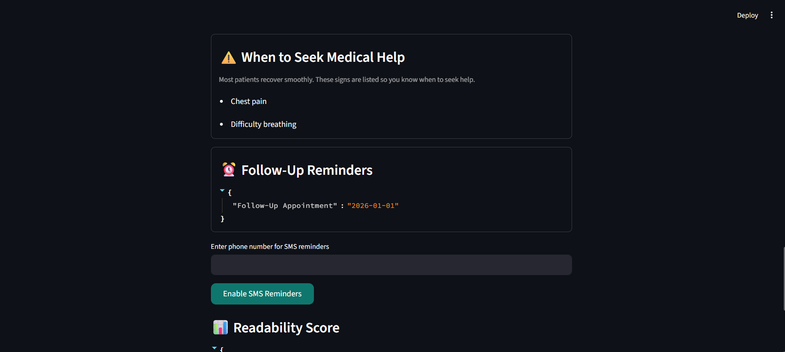
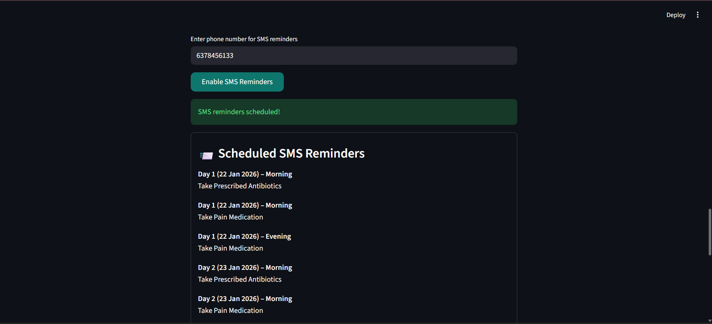

# 🏥 Discharge Instruction Simplifier & Agentic Care Planner

A **patient-centric, explainable AI system** that transforms complex hospital discharge instructions into **clear, actionable care plans**, with **transparent agent reasoning** and a **safety-first design**.

---

## 🚀 Live Demo
- 🔗 **Streamlit App:** https://healthcare-discharge-agent-aiignite.streamlit.app/
- 🔗 **GitHub Repository:** https://github.com/geraldineamalor/healthcare-discharge-agent

---

## 📌 Problem Statement

Hospital discharge instructions are often:
- Written in complex medical language
- Difficult for patients to follow correctly
- Prone to misinterpretation, leading to poor adherence and readmissions

Patients frequently struggle to understand:
- Medication schedules
- Duration of treatment
- Activity restrictions
- Warning signs requiring medical attention

---

## 💡 Solution Overview

This project introduces an **Agentic Discharge Instruction Assistant** that:

- Simplifies medical instructions into plain language
- Generates **day-wise care plans and checklists**
- Handles **multiple medications with different durations**
- Highlights **danger signs** and **follow-up timelines**
- Explains **how decisions were made** using an Agent Reasoning Panel

> The system prioritizes **deterministic logic and transparency**, avoiding hallucination-prone AI outputs in medical workflows.

---

## 🧠 Agentic Workflow

The system follows a structured **agent-like reasoning pipeline**:

1. **Detection** – Extracts medications, frequencies, durations, and follow-ups  
2. **Planning** – Builds a multi-day action plan  
3. **Scheduling** – Handles overlapping medication timelines  
4. **Safety Reasoning** – Identifies danger signs and follow-up needs  
5. **Explanation** – Exposes internal reasoning for transparency  

---

## 🩺 Key Features

### ✅ Simplified Instructions
- Converts clinical text into patient-friendly language

### ✅ Daily Care Checklist
- Morning / Afternoon / Evening tasks
- Progress tracking for adherence

### ✅ Medication-Aware Planning
- Independent handling of medication durations
- Prevents under- or over-treatment

### ✅ Agent Reasoning Panel
- Explains *why* the care plan looks the way it does
- Improves trust and auditability

### ✅ Safety & Follow-Up Awareness
- Highlights warning signs
- Dynamically calculates follow-up dates

### ✅ SMS Reminder (Mock)
- Demonstrates extensibility for real-world reminders

---

## 📸 Application Screenshots

### 🏠 Home Screen


### 📄 Simplified Discharge Instructions


### 📅 Personalized Action Plan


### ⚠️ Danger Signs & Follow-Up


### 📲 SMS Reminder Preview


---

## 🛡 Why We Avoided LLM APIs

In healthcare systems:
- Hallucinations are unacceptable
- Explainability is mandatory
- Deterministic behavior is preferred

This project deliberately avoids black-box LLM APIs and instead relies on:
- Structured extraction
- Heuristic reasoning
- Retrieval-assisted context

---

## 🧩 Tech Stack

| Category | Tools |
|--------|------|
| Frontend | Streamlit |
| NLP | textstat, langdetect |
| Retrieval | sentence-transformers, numpy |
| Scheduling | python-dateutil |
| Data Handling | pandas |
| Notifications | Twilio (Mock) |

---

## 📂 Project Structure

```text
healthcare-discharge-agent/
├── app.py
├── services/
│   ├── action_plan.py
│   ├── agent_reasoning.py
│   ├── duration_utils.py
│   ├── reminders.py
│   ├── care_type.py
│   └── rag/
│       ├── loader.py
│       ├── retriever.py
│       ├── danger_generator.py
│       └── guidance_generator.py
├── utils/
│   ├── disclaimers.py
│   └── citations.py
├── evaluation/
│   └── readability.py
├── requirements.txt
├── README.md
└── .gitignore
```
---

## 🧪 Sample Input
Take prescribed antibiotics twice daily for 7 days.
Avoid strenuous activity for 1 week.
Follow up with the primary care physician in 1 week.

---

## ⚠️ Disclaimer

This tool is designed to assist patients in understanding discharge instructions.
It does not replace professional medical advice.

