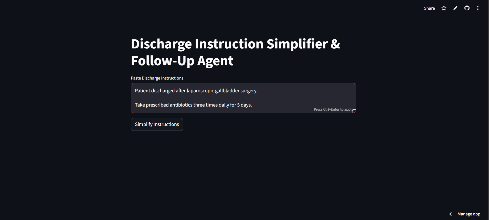
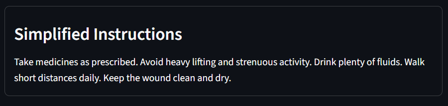
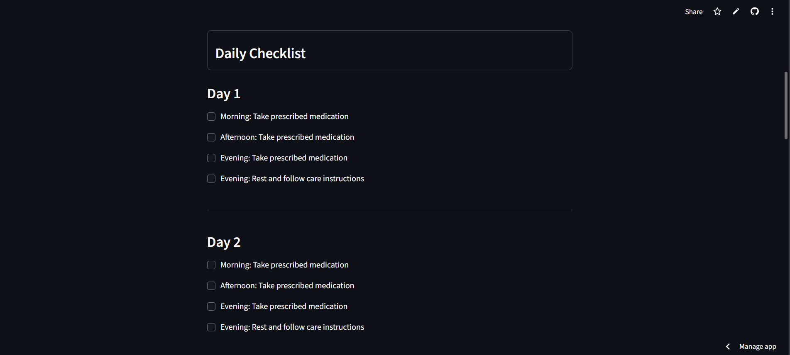
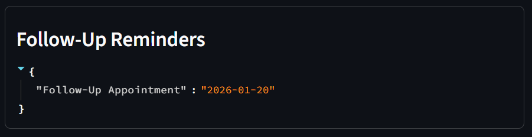

# 🏥 Discharge Instruction Simplifier & Follow-Up Agent

A healthcare-focused **agentic AI application** that transforms complex hospital discharge instructions into clear, actionable, and patient-friendly care plans with daily checklists, danger alerts, and follow-up reminders.

---

## 🔗 Project Links

- **Live Demo (Streamlit):** https://YOUR-STREAMLIT-LINK  
- **GitHub Repository:** https://github.com/YOUR-GITHUB-REPO  

---

## 📌 Problem Statement

Hospital discharge instructions are often written in complex medical language. Patients struggle to understand medication schedules, lifestyle restrictions, follow-up timelines, and danger signs — leading to poor adherence, missed appointments, and preventable health complications.

---

## 💡 Solution Overview

This application acts as an **intelligent discharge assistant** that:
- Simplifies medical instructions
- Automatically classifies care type (acute vs chronic)
- Generates structured daily care plans
- Highlights personalized danger signs
- Creates follow-up reminders
- Tracks daily task completion through a checklist

---

## 🚀 Key Features

- 📄 Simplified discharge instructions  
- 🩺 Care classification (Acute / Chronic)  
- 📅 Dynamic action plan generation  
- ✅ Daily checklist with progress tracking  
- ⚠️ Danger sign detection  
- ⏰ Follow-up reminder creation  
- 📊 Readability score analysis  
- 🧠 Agentic decision logic  

---

## 🧠 Agentic AI Design

This project follows an **agentic AI architecture** using deterministic decision-making and tool orchestration rather than black-box LLMs.

### Agentic capabilities implemented:
- **Autonomous decision-making** – determines care type and workflow automatically  
- **Multi-step planning** – breaks unstructured text into tasks, timelines, and reminders  
- **Tool usage** – modular services for simplification, planning, alerts, and reminders  
- **Context awareness** – preserves instruction context across modules  
- **State management** – tracks checklist completion using session state  

> The system is **LLM-ready** and can be extended with RAG or local/cloud LLMs in future versions.

---

## ⚙️ How the System Works
# 🏥 Discharge Instruction Simplifier & Follow-Up Agent

A healthcare-focused **agentic AI application** that transforms complex hospital discharge instructions into clear, actionable, and patient-friendly care plans with daily checklists, danger alerts, and follow-up reminders.

---

## 🔗 Project Links

- **Live Demo (Streamlit):** https://healthcare-discharge-agent-aiignite.streamlit.app/
- **GitHub Repository:** https://github.com/geraldineamalor/healthcare-discharge-agent

---

## 📌 Problem Statement

Hospital discharge instructions are often written in complex medical language. Patients struggle to understand medication schedules, lifestyle restrictions, follow-up timelines, and danger signs — leading to poor adherence, missed appointments, and preventable health complications.

---

## 💡 Solution Overview

This application acts as an **intelligent discharge assistant** that:
- Simplifies medical instructions
- Automatically classifies care type (acute vs chronic)
- Generates structured daily care plans
- Highlights personalized danger signs
- Creates follow-up reminders
- Tracks daily task completion through a checklist

---

## 🚀 Key Features

- 📄 Simplified discharge instructions  
- 🩺 Care classification (Acute / Chronic)  
- 📅 Dynamic action plan generation  
- ✅ Daily checklist with progress tracking  
- ⚠️ Danger sign detection  
- ⏰ Follow-up reminder creation  
- 📊 Readability score analysis  
- 🧠 Agentic decision logic  

---

## 🧠 Agentic AI Design

This project follows an **agentic AI architecture** using deterministic decision-making and tool orchestration rather than black-box LLMs.

### Agentic capabilities implemented:
- **Autonomous decision-making** – determines care type and workflow automatically  
- **Multi-step planning** – breaks unstructured text into tasks, timelines, and reminders  
- **Tool usage** – modular services for simplification, planning, alerts, and reminders  
- **Context awareness** – preserves instruction context across modules  
- **State management** – tracks checklist completion using session state  

> The system is **LLM-ready** and can be extended with RAG or local/cloud LLMs in future versions.

---

## ⚙️ How the System Works

``` bash
Discharge Instructions
↓
Text Simplification
↓
Care Type Classification
↓
Action Plan Generation
↓
Daily Checklist Creation
↓
Danger Sign Detection
↓
Follow-Up Reminder Scheduling

```
---

## Application Screenshots

  
*Figure 1: Discharge instruction input interface.*

  
*Figure 2: Simplified, patient-friendly discharge instructions generated by the agent.*

  
*Figure 3: Dynamic daily checklist generated based on medication duration and care type.*

  
*Figure 4: Personalized danger signs detected from discharge instructions.*

  
*Figure 5: Follow-up reminder generation based on extracted timelines.*

---

## Tech Stack

- **Frontend:** Streamlit  
- **Backend:** Python  
- **NLP:** Rule-based parsing and heuristics  
- **Architecture:** Modular service-based design  

---

## How to Run Locally

```bash
git clone https://github.com/YOUR-GITHUB-REPO
cd healthcare-discharge-agent
python -m venv venv
venv\Scripts\activate   # Windows
pip install -r requirements.txt
streamlit run app.py
```
---

## Future Enhancements

- Retrieval-Augmented Generation (RAG) with medical guidelines

- Multilingual instruction support

- Real SMS / notification integration

- EHR system integration

- Voice-based discharge instructions

- Clinician monitoring dashboard

## Hackathon Relevance

This project demonstrates:

- Real-world healthcare impact

- Agentic AI principles

- Safe and explainable decision logic

- Scalable and extensible architecture

## License

This project is developed for educational and hackathon purposes.